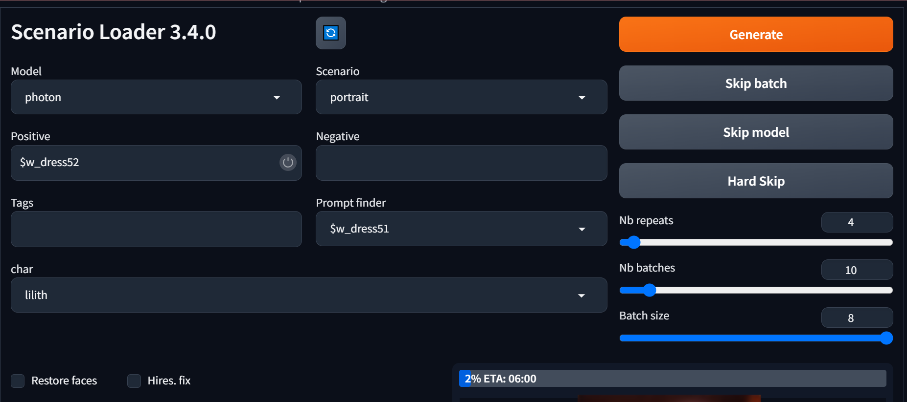
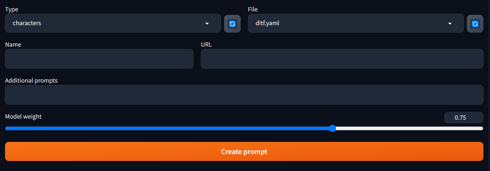
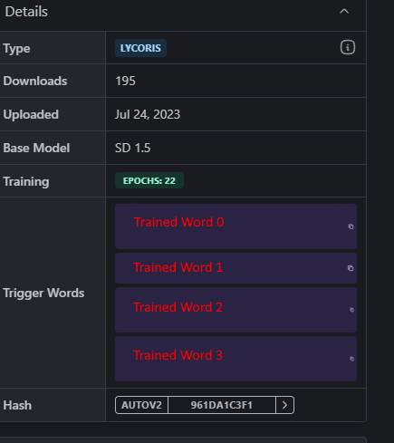
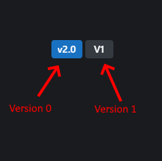
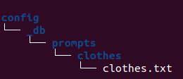
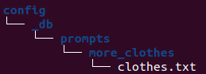

# Scenario loader

A custom extension for [AUTOMATIC1111/stable-diffusion-webui](https://github.com/AUTOMATIC1111/stable-diffusion-webui) that adds a way to template image creation using a scenarios.


Before anything:

> If you don't know what yaml is, please look it up before using this extension as it makes an extensive use of this format.

## Table of Contents

  * [Introduction](#introduction)
  * [First steps](#first-steps)
  * [Vocabulary](#vocabulary)
    * [Config](#config)
    * [Database](#database)
  * [Tabs](#tabs)
    * [Sc Loader](#sc-loader)
    * [Expander creation](#expander-creation)
    * [Sc Tools](#sc-tools)
      * [Batch download](#batch-download)
      * [Download](#downloads)
      * [Open to SC pose](#openpose-to-sc-pose)
      * [Create file](#create-file)
      * [Create DB](#create-db)
    * [Sc DB Edit](#sc-db-edit)
  * [Using the database](#using-the-database)
    * [Character types](#character-types)
    * [Prompts blacklist](#prompts-blacklist)
    * [Characters](#characters)
    * [Expanders](#expanders)
    * [Scenarios](#scenarios)
    * [Series](#series)
 * [To go further](#to-go-further)
    * [Understanding the database](#understanding-the-database)
    * [Filters](#filters)

## Introduction

Scenario loader is extension that aims to make the process of repeating a similar scenarios with different characters easier.

Say you want to create a situation in which two characters are kissing. By building a scenario that corresponds to that scene, you'll then be able to replicate the scenario with different characters across different models easily.

A scenario will handle the prompts as well as the scripts. It automates things such as controlnet openposes, latent couple, etc.

It also includes features such as a wildcard system and civitai scrapping.

## First steps

Please head to the Sc Tools and select the last option. Copy the path of where you'd like the Sc Loader DB to be at and click on the Gooo! button.

## Vocabulary

### Config

The config is the folder where all the configuration is stored. By default it is set to be in this extension's directory. I strongly advise to move it somewhere else and to change the path in the settings (using A1111's UI).

In this directory will be found:

- The [database](#database)
- The [poses](#poses)
- The [filters](#filters)

Please note that you will probably have to interact with this folder a lot. It would be better to put it somewhere easy to access or to add a shortcut to its location. Also, if you know how to use git, I would advise to use it to ensure you don't lose anything.

### Database

The database is a folder found inside the [config](#config). It is the heart of the application as it will store all the data you will use.

The database folder is named `_db` and must not be renamed.

To properly use the database, see [here](#using-the-database).

## Tabs

### Sc Loader

This `Sc loader` tab should look like this:


Sc Loader does not use the model defined in the checkpoint selection. You should use the model dropdown menu. You will find two sections:
 - **Lists**: The [series](#series)
 - **Models**: The models

Selecting a model should work just as usual. Selecting a serie will resulting in using the whole serie (look at the corresponding section).

The scenario should work the same way. Selecting a scenario will make the characters inputs appear. They will correspond to the characters of the scenario. If a serie is provided the first scenario will be used. Hence, it's ok to have scenario with different characters in the same serie as long as they are all refered to in the first scenario.

The positive and negative section are simply the usual prompt/negative prompt. Everything typed here will be added to their corresponding prompt. Expanders do work here.

The expander finder does nothing except showing you all the expanders stored in the database. It's just here to help you look for them and copy them if needed.

The refresh button at the top will refresh all these input fields.

The **skip batch** button is your usual *skip* button.

The **skip model** button is explained in the [series section](#series).

The **hard skip** button is your usual *interrupt* button, it will also stop the repeats.

Repeats are basically the number of time the (batch size*nb batch) is repeated with a refreshed payload. Refreshed basically meaning random expanders will be random each repeat but not every batch.

Tags is just a list of comma separated string the can be used inside scenario to variabilize them.

The rest should pretty straight forward. They the classical options. If an option is accompanied by a checkbox for override, it means it's not used by default (ensuring the scenarios' options are preferred) so you have to tick them to use them.

### Expander creation

The prompt creator tab should look like this:


When starting you should only have the **characters** options for the type field. It corresponds to the `prompts/characters` folder of your database. To add a new type, simply add a new folder. And to add new files, create new files.

As exepcted, the refresh buttons will refresh the corresponding fields.

The rest of it is here to help you create a character or anything you want using civitai's API. The name field should be the name of the expander you want to create. The URL should be the Lora/Lycoris/TI it's based on. (This tab not handle anything more complex or other types of models)

It will get the model, install it and create the expander using the trained words given on civitai.

Downloaded models have the AutoV2 hash appended to them if given, otherwise the name of the creator is appended. So you don't have to worry about conflicting model names.

Lycoris are added to the `LyCORIS` folder.

You can adjust the weight of the model using the model weight.

You can leave put a `_` inside the name field to let Sc Loader try to create the name using the civitai data.

You can add **additional prompts** using the corresponding fields.

<ins>For more complex models:</ins>

You may want to cherry pick the trained words or to pick a specific version of the model.

You can cherry-pick the trained words by adding the indexes of the trained words you want between bracket at the end of the URL.

Example:



Let's say I want only trained words 0, 1 and 3. Then my url would look like: `https://civitai.com/models/123456/my-model[0,1,3]`

You can pick a specific version by appendic in the same manner `@<version number>` at the end of the URL:



Let's say I want the version "V1". Then my url would look like: `https://civitai.com/models/123456/my-model@1`


You can use both: `https://civitai.com/models/123456/my-model[0,1,3]@1`

Please remember it starts at 0.

### Sc Tools

A tab with a few tools to use.

#### Batch download

Batch download, allow the download of a batch, which is basically a list of element to download from civitai.

Just refer to the name of `.txt` file in the db batches folder. Each line can be:
 * `<civitai_url>[opts] <folder>/<file>.yaml [name] [weight]`: equivalent to the prompt creation tab in a line, name and weight can be swapped and are optional. It can be followed by 0 to 3 lines of prompts starting with `> ` to add positive/negative prompts:
```
https:.... characters/misc.yaml name 0.75
https:.... characters/misc.yaml 0.8
> a positive prompt
https:.... characters/misc.yaml name2
> a positive prompt
> a negative prompt
```
 * `<civitai_url>`: an URL for either a base model, an openpose package or a wildcard package

If a line starts with "*" the batch downloader will ignore it. Every time you run a batch download, it will add that before every line it was successful downloading making the rerun much faster. (Re run will most definitely happen given civitai tendency to timeout requests :p)

#### Downloads

Three options to download a base model, a wildcard package or an openpose package.

#### Openpose to Sc Pose

Give a path to an openpose json file inside the pose folder to create an sc pose equivalent.

#### Create file

Give a path inside the db, the file and folders will be created.

#### Create DB

Give a path anywhere in the computer and a DB will be created there and SC Loader settings will point to that location.

### Sc DB Edit

A very basic file editor for the database for people really reluctant to use an editor. Select a file and load it with the reload button. Save with the save button. For JSON and YAML files it will ensure they are correctly formatted.

## Using the database

### Character types

Character types are the types of character that can be used in a scenario. It a simple file at the root of the database. Each line is a type of character.

They are used to generate the corresponding field in the UI and a reload will be needed if more character types are added. So feel free to add as many as you think you will need.

### Prompts blacklist

A list of word to blacklist from triggerwords when creating an expander.

### Characters

A character is basically a prompt that is used as part of a scenario.

You can learn how to create one [here](docs/character_creation.md).

You can learn how to use one [here](sc-loader).

### Expanders

Expanders are prompts (and are often refered as prompts) that are defined in the `prompts` folder of the database. They can either be a list or a string.

When defined as string, they are simply a shortcut for that prompt. When defined as a list, a random element of the list will be used.

They can be defined as a yaml key/value:

```yaml
short: short hair
rnd:
 - short hair
 - long hair
```

Alternatively, you can create a `.txt` file. The name of the file will become the key and its lines a list.

So the file `rnd.txt`:
```
short hair
long hair
```

Results in the same key/value pair as the one defined in the previous example.

Dicts are also supported to nest expanders:
```yaml
my:
  expander: myprompt # used with $my.expander
```


**Expanders can be used in prompts using a `$` prefix.**

Expanders can be used inside other expanders:

```yaml
short: short hair
rnd:
 - $short
 - long hair
```

When creating subfolders, the prompts will be added using the four first letters of each underscore separated word of the folder name.

Examples:



Gives the expander: `$clot_clothes`



Gives the expander: `$moreclot_clothes`

### Scenarios

A scenario is a sort of template to generate images. It's a yaml dictionary.

You can learn how to create one [here](docs/scenario_creation.md) or [here](#prompt-creator).

You can learn how to use one [here](#sc-loader).

### Pages

Pages are special kind of scenarios made of normal scenario that will create comics like pages.

You can learn how to create one [here](docs/page_creation.md).

### Series

Series are lists defined as `.txt` files in their corresponding folder within the database `series` folder.

Series can be of four types:
 - Models: list of models to run a scenario on
 - Scenarios: list of scenarios to use characters with
 - Characters: list of characters to use on the scenario(s)
 - Poses: list of poses that can be used with controlnet, a random pose is selected

At the exception of poses, series, when used in the scenario loader, will results in "`couplings`". A coupling is a match between a model, a scenario and the characters.

Let's imagine you have:
 - a serie of two models m1 and m2
 - a serie of two scenarios s1 and s2
 - a serie of two characters c1 and c2
 - a serie of two characters c3 and c4

Running scenario loader with all these series (assuming s1 and s2 accepts two characters) would result in the following couplings:
```
m1 - s1 - c1 - c3
m1 - s1 - c1 - c4
m1 - s1 - c2 - c3
m1 - s1 - c2 - c4
m1 - s2 - c1 - c3
m1 - s2 - c1 - c4
m1 - s2 - c2 - c3
m1 - s2 - c2 - c4
m2 - s1 - c1 - c3
m2 - s1 - c1 - c4
m2 - s1 - c2 - c3
m2 - s1 - c2 - c4
m2 - s2 - c1 - c3
m2 - s2 - c1 - c4
m2 - s2 - c2 - c3
m2 - s2 - c2 - c4
```

Which mean that at least 16 payloads will generated. So if you have decided on:
- batch size = 2
- nb of batch = 4
- nb of repeat = 6
You would generate `6x4x2x16 = 768` images.

In that case, the 384 images generated will be generated with the model "m1". So if you don't want to stop an execution but are already displeased with the model, you can use the "Skip model" button. It will skip this model until the end of the execution.

It should be noted that it will not skip until the next model, it will skip the model throughout the whole execution. If the model appears twice in the model serie, it will be skipped again.


## To go further

The following part is for people with a bit of technical background. It explains in more details some of the inner workings or what can be done if can code.

### Understanding the database

The database is recursively loaded and is translated internally as a dictionary.

In a folder, the files are handled as follow:
 - `.txt|.text`: filename becomes a key, the content is a list using lines
 - `.json|.yaml|.yml`: key are added if dict, if list handled like the text files
 - *any other file*: added as a key (filename) to string (content)

Then each folder will turn into a key and its content the new value.

If the folder starts with an underscore, then its content is treated as if it were part of its parent.

After that, the specific case of the folders inside `prompts` is handled.

Yaml and JSONs files are loaded using the [sonotoria lib](https://pypi.org/project/sonotoria/). So you can use jinja2 inside them.


### Filters

Any jinja2 filters can be added inside the `filters.py` file. Inside it is referenced the context at the state of the creation of the payload. A filter will be any function added in the dictionary returned by the `get_filters` function. You don't need to reload the app to reload the filters, they are always reloaded.
