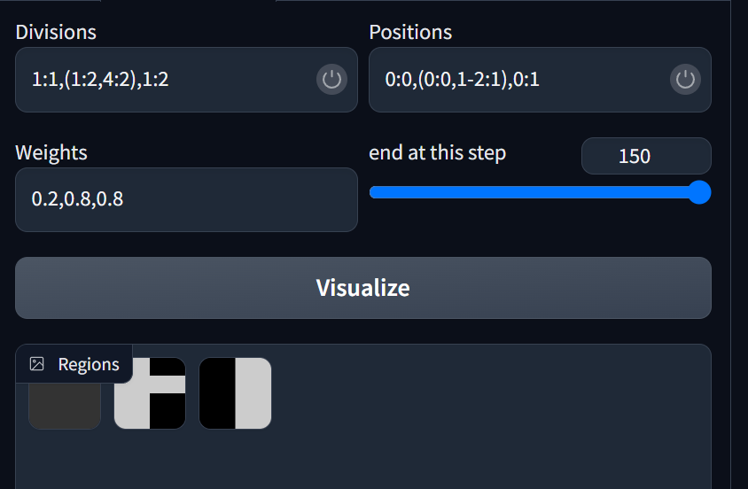

# Scenario creation

This page describes of to define a scenario.

## Table of content

  * [Where](#Where)
  * [Main structure](#main-structure)
  * [Characters](#characters)
  * [Prompts](#prompts)
  * [Base payload](#base-payload)

## Where

A scenario is a yaml key/value that can be added in any yaml within the `scenarios` folder inside the database.

## Main structure

A scenario is defined as a list of character types, some prompts, and a base payload. Hence the main structure of the yaml should be:

```yaml
<name of the scenario>:
    characters: <list of character types>

    prompts: <definition of prompts>

    base_payload: <definition of the base payload>
```

## Characters

The `characters` key only contain a list of string the corresponds to some of the character types defined in the database.

Please note that in order to be used, the characters must be defined in the character_types.

Each character type references here must have a corresponding key in the [prompt section](#prompts).

Example:

```yaml
scenario_name:
  characters:
    - character1
    - character2

    ...
```

## Prompts

The prompts sections at least the three following key:
 - `quality`: this is where all the prompts regarding the "quality" of the image should be placed.
 - `general`: this is the general prompt, what the scenario is about.
 - `negative`: this is the negative prompt.

After these three keys, there should be one key for every character referenced in the [`characters` section](#characters). Each of these keys will have a dictionary as value with the following key:
 - `pre`: a prompt that will be placed before the prompt of the character
 - `post`: a prompt that will be placed after the prompt of the character

Following the previous example, you should now have something like that:
```yaml
scenario_name:
  characters:
    - character1
    - character2

  prompts:
    quality: $positive
    general: 1boy, 1girl, holding hands
    negative: $negative
    character1:
      pre: 1boy
      post: holding hands
    character2:
      pre: 1girl
      post: holding hands

    ...
```

## Base payload

The base payload is the payload that will be used to create the images. It is mostly equivalent to the payload you would give when calling the `sdapi/txt2img`.

The default values should be defined as follows:

```yaml
steps: 35
cfg_scale: 7.5
width: 512
height: 512
restore_faces: no
sampler_name: DPM++ 2M Karras
seed: -1
```

Not that only width and height cannot then be overriden in the UI. So you should mostly focus on `height` and `width`. A portrait payload might be a simple as:

```yaml
portrait_scenario:
  characters:
    - character1

  prompts:
    quality: $positive
    general: portrait
    negative: $negative
    character1: {'pre': '', 'post': ''}

  base_payload:
    height: 768
```

You can also have an empty payload of course:
```yaml
base_payload: {}
```

Now the intersting part is that you can add parameters for scripts such as `controlnet`, `latent couple` or  `composable lora`.

As long as those scripts are able to handle an API call, this should work.

On that regard, I used to use [that version](https://github.com/ashen-sensored/stable-diffusion-webui-two-shot) of latent couple/two shot. Using it I would have to change manually the tab in the UI to use the rectangle sections. So I made a fork to solve that problem.

My fork also handles multiple rectable per section as shown here:



You can access and install this fork using [this link](https://github.com/Chaest/stable-diffusion-webui-two-shot).

If you want to know exactly how to use every paramters for a script, I advise you take a look at their individual documentations. As for the three scripts mentionned above here is a full example:

```yaml
portrait_scenario:
  characters:
    - character1

  prompts:
    quality: $positive
    general: portrait
    negative: $negative
    character1: {'pre': '', 'post': ''}

  base_payload:
    height: 768
    alwayson_scripts:
      controlnet:
        args:
          - input_image: a_pose.jpg # a file/serie inside 'poses'
            model: control_sd15_openpose [fef5e48e] # can be omitted
      Latent Couple extension:
        args:
          - yes
          - 1:1,1:12,1:12
          - 0:0,0:0-5,0:5-12
          - 0.2,0.8,0.8
          - 150
      Composable Lora:
        args:
          - yes
          - no
          - no
```

Controlnet is getting a special treatment. If a controlnet pose is given, the file will be read by the extension, you just have to give the name of a file or a pose serie from the database. Also the model shown here can be omitted.
